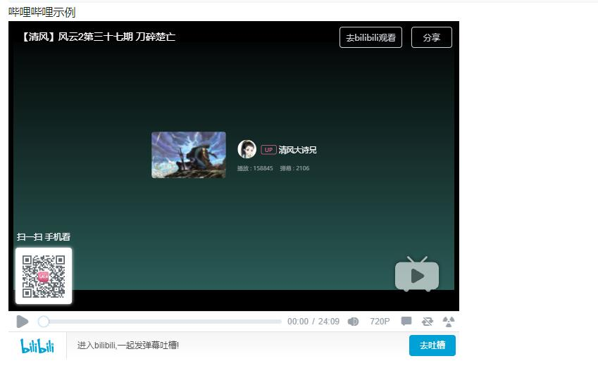

= asciidoctor-bilibili-extension

== 简介

使用asciidoc编写文档时有时需要插入视频用于解释文档中的内容或者是作为引用内容供读者自行访问，asciidoctor默认支持 https://docs.asciidoctor.org/asciidoc/latest/macros/audio-and-video/[插入youtube和vimeo视频内容]，而中国开发者更多会使用Bilibili进行内容传播或分享，因此开发此插件用于在asciidoc文档中插入Bilibili视频

== 使用方法

在asciidoc文档中使用bilibili宏加上BV号即可，支持使用width和height配置播放器的宽和高，默认为640x480，也可以在视频上方添加标题

[source,asciidoc]
----
.哔哩哔哩示例
bilibili::BV1gt411f7H4[width=800,height=600]
----

然后在asciidoctor-maven插件配置中添加如下 https://mvnrepository.com/artifact/io.github.pxzxj/asciidoctor-bilibili-extension/1.0[依赖]

[source,xml,subs="verbatim"]
----
<dependency>
    <groupId>io.github.pxzxj</groupId>
    <artifactId>asciidoctor-bilibili-extension</artifactId>
    <version>1.0</version>
</dependency>

----

之后maven compile就可以生成包含bilibili视频的html文档了，完整示例参考 https://github.com/pxzxj/asciidoc-cicd-demo[asciidoc-cicd-demo]

== 实现原理

参考 https://docs.asciidoctor.org/asciidoctorj/latest/extensions/extensions-introduction/[AsciidoctorJ Extensions API]